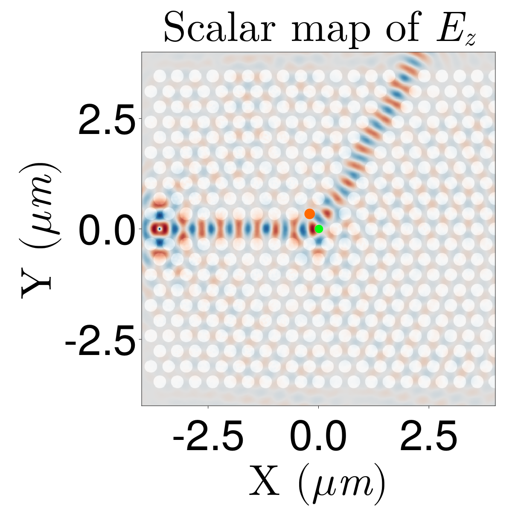
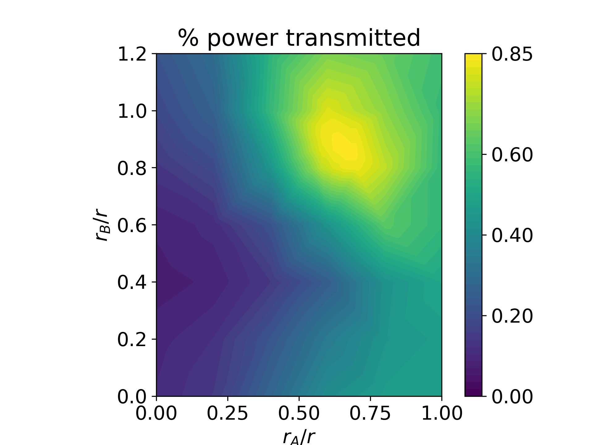

# POSTECH_MECH403_final

Source code for the final report in the course Intro.to Nanoscale Science & Engineering (MECH403)

| $E_z$ map  | Power transmitted |
| ------------- | ------------- |
|   |   |

